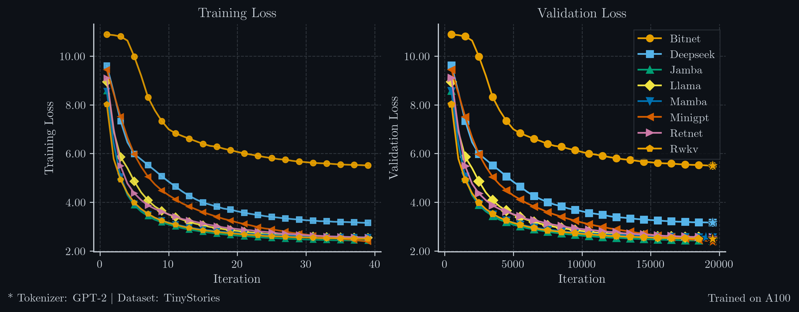

# OpenSLM



Experiment platform for small language models. Swap architectures with one config line, define new experiments with a YAML file, add new SLM implementations without touching pipeline code.


**Author**: Ashwin Shirke

---

## Setup

```bash
python -m venv .venv && source .venv/bin/activate
pip install -e ".[dev]"
```

---

## Quick Start

```bash
# 1. Tokenise TinyStories (~10 min, one-time)
make prep     MODEL=miniGPT_config

# 2. Train the baseline GPT model (automatically uses GPU/MPS if available)
make train    MODEL=miniGPT_config

# 3. Generate text from the saved checkpoint
make generate MODEL=miniGPT_config
```

Or with explicit config targets:

```bash
python main.py prep     --config configs/miniGPT_config/experiments/exp_001_baseline.yaml
python main.py train    --config configs/miniGPT_config/experiments/exp_001_baseline.yaml
python main.py evaluate --config configs/miniGPT_config/experiments/exp_001_baseline.yaml
python main.py generate --config configs/miniGPT_config/experiments/exp_001_baseline.yaml \
                        --prompt "Once upon a time"
```

---

## Architecture Zoo

9 SLM architectures implemented at the ~29–53 M parameter scale, trained on TinyStories with identical tokenizer and training budget. See [`reports/01_architecture_zoo.md`](reports/01_architecture_zoo.md) for the full comparison and [`reports/10_compare.md`](reports/10_compare.md) for results.

| Registry Key | Params (total) | Active | Key Innovation | Report |
|---|---|---|---|---|
| `gpt` | 30.0 M | 30.0 M | Vanilla transformer baseline | [02_gpt.md](reports/02_gpt.md) |
| `llama` | 28.7 M | 28.7 M | RMSNorm + RoPE + GQA + SwiGLU | [03_llama.md](reports/03_llama.md) |
| `gemma3` | 28.7 M | 28.7 M | Local/global attention + QK norm + logit soft-cap + GeGLU | [11_gemma3.md](reports/11_gemma3.md) |
| `deepseek_moe` | 34.7 M | ~27.6 M | Shared + routed MoE experts | [06_deepseek_moe.md](reports/06_deepseek_moe.md) |
| `mamba` | 30.4 M | 30.4 M | Selective SSM, no attention | [08_mamba.md](reports/08_mamba.md) |
| `rwkv` | 53.0 M | 53.0 M | WKV recurrence, O(1) inference | [09rwkv.md](reports/09rwkv.md) |
| `jamba` | 34.8 M | 34.8 M | Hybrid Mamba + Attention | [07_jamba.md](reports/07_jamba.md) |
| `bitnet` | 28.8 M | 28.8 M | Ternary weights {-1, 0, +1} | [04_bitnet.md](reports/04_bitnet.md) |
| `retnet` | 29.9 M | 29.9 M | Multi-scale decay, no softmax | [05_retnet.md](reports/05_retnet.md) |

### Training any architecture

```bash
# Data prep is shared (run once)
make prep MODEL=miniGPT_config

# Train any model
make train MODEL=llama_config
make train MODEL=mamba_config
make train MODEL=deepseek_moe_config

# Architecture Zoo convenience targets
make train-llama
make train-gemma3
make train-mamba
make train-rwkv
make train-jamba
make train-bitnet
make train-retnet
make train-deepseek-moe

# Generate text
make generate MODEL=llama_config
```

---

## Project Structure

```
main.py                      ← CLI entry point (prep / train / evaluate / generate)

src/
  models/                    ← SLM plugins and non-model config dataclasses
    gpt/                     ← GPT-2 baseline
    llama/                   ← LLaMA-style (RoPE + RMSNorm + GQA + SwiGLU)
    gemma3/                  ← Gemma 3 (local/global attn + QK norm + logit soft-cap + GeGLU)
    deepseek_moe/            ← DeepSeek MoE (shared + routed experts)
    mamba/                   ← Mamba SSM (no attention, O(n))
    rwkv/                    ← RWKV (linear attention RNN)
    jamba/                   ← Jamba (Mamba + Attention interleaved)
    bitnet/                  ← BitNet 1.58b (ternary weights)
    retnet/                  ← RetNet (multi-scale retention)
    _template/               ← copy-paste scaffold for a new model
    __init__.py              ← auto-discovery, exports config dataclasses
  core/                      ← framework only (no model code)
    base.py                  ← BaseSLM ABC
    registry.py              ← register_model decorator, create_model factory
    attention.py             ← CausalSelfAttention (GPT + Jamba)
    blocks.py                ← TransformerBlock (GPT)
    layers.py                ← LayerNorm, MLP (GPT)
    generation.py            ← autoregressive generate()
    normalization.py         ← RMSNorm (all new architectures)
    rope.py                  ← Rotary Position Embeddings
    ffn.py                   ← SwiGLU FFN
    mamba_block.py           ← Mamba SSM block (Mamba + Jamba)
  pipelines/                 ← orchestration (training, inference, data prep, evaluation)
  infra/                     ← I/O: config loading, checkpoints, device setup, logging
  utils/                     ← stateless helpers: optimizer, scheduler, scaler

configs/
  miniGPT_config/            ← GPT-2 baseline configs
  llama_config/              ← LLaMA configs
  gemma3_config/             ← Gemma 3 configs
  deepseek_moe_config/       ← DeepSeek MoE configs
  mamba_config/              ← Mamba configs
  rwkv_config/               ← RWKV configs
  jamba_config/              ← Jamba configs
  bitnet_config/             ← BitNet configs
  retnet_config/             ← RetNet configs
  config_template/           ← scaffold for new models

scripts/
  miniGPT_scripts/           ← run_data_prep.sh, run_training.sh, run_inference.sh
  llama_scripts/             ← same for LLaMA
  deepseek_moe_scripts/
  mamba_scripts/
  rwkv_scripts/
  jamba_scripts/
  bitnet_scripts/
  retnet_scripts/

tests/
  test_core/                 ← framework tests + shared primitive tests
  test_models/               ← per-architecture forward/generate/parameter tests
  test_infra/                ← config loading, checkpoints
  test_pipelines/            ← training loop smoke tests

reports/
  00_code_design.md          ← codebase design: registry, config, BaseSLM contract
  01_architecture_zoo.md     ← all 8 architectures: taxonomy, protocol, shared primitives
  02_gpt.md                  ← GPT architecture reference
  03_llama.md                ← LLaMA: RMSNorm, RoPE, GQA, SwiGLU
  04_bitnet.md               ← BitNet 1.58b: ternary weights, STE
  05_retnet.md               ← RetNet: multi-scale retention, no softmax
  06_deepseek_moe.md         ← DeepSeek MoE: routing, load balancing, shared experts
  07_jamba.md                ← Jamba: hybrid Mamba + Attention
  08_mamba.md                ← Mamba SSM: selective scan, no attention
  09rwkv.md                  ← RWKV: WKV recurrence, token shift
  10_compare.md              ← controlled comparison results across all 8 architectures
```

---

## Running Experiments

```bash
# Default experiment (exp_001_baseline)
make train    MODEL=miniGPT_config

# Pick a specific experiment
make train    MODEL=llama_config  EXP=exp_002_bigger_model

# Other tasks
make prep     MODEL=miniGPT_config   # (data is shared — run once)
make evaluate MODEL=llama_config
make generate MODEL=mamba_config
```

`MODEL` maps to a folder under `configs/`. `EXP` selects the experiment YAML inside that folder's `experiments/` directory (default: `exp_001_baseline`).

---

## Tests

```bash
make test          # full suite
make test-core     # core framework + shared primitives (fast, CPU, no network)
make test-models   # all 8 architecture tests
make lint          # ruff
```

---

## Documentation

| File | Contents |
|---|---|
| `reports/00_code_design.md` | Codebase design: plugin registry, config system, BaseSLM contract, invariants |
| `reports/01_architecture_zoo.md` | All 8 architectures: taxonomy, experimental protocol, shared primitives |
| `reports/02_gpt.md` | GPT baseline: architecture, parameters, preset configs |
| `reports/03_llama.md` | LLaMA: RMSNorm, RoPE, GQA, SwiGLU |
| `reports/04_bitnet.md` | BitNet 1.58b: ternary weights, STE, training dynamics |
| `reports/05_retnet.md` | RetNet: multi-scale retention, no softmax |
| `reports/06_deepseek_moe.md` | DeepSeek MoE: routing, load balancing, shared experts |
| `reports/07_jamba.md` | Jamba: hybrid Mamba + Attention |
| `reports/08_mamba.md` | Mamba SSM: selective scan, no attention |
| `reports/09rwkv.md` | RWKV: WKV recurrence, token shift, parallel scan |
| `reports/10_compare.md` | Controlled comparison results: all 8 trained architectures at 30M params |
| `reports/11_gemma3.md` | Gemma 3: local/global attention, QK norm, logit soft-capping, GeGLU |

---

## Credits

Architecture based on [nanoGPT](https://github.com/karpathy/nanoGPT) by Andrej Karpathy.

---

## Available Models

The weights for all architectures are available on Hugging Face. Each model has been trained with approximately **30M parameters**. 

You can find the models here:
- [Ashwin399/OpenSLM_BitNet_30M](https://huggingface.co/Ashwin399/OpenSLM_BitNet_30M)
- [Ashwin399/OpenSLM_Deepseek_30M](https://huggingface.co/Ashwin399/OpenSLM_Deepseek_30M)
- [Ashwin399/OpenSLM_Jamba_30M](https://huggingface.co/Ashwin399/OpenSLM_Jamba_30M)
- [Ashwin399/OpenSLM_Llama_30M](https://huggingface.co/Ashwin399/OpenSLM_Llama_30M)
- [Ashwin399/OpenSLM_Mamba_30M](https://huggingface.co/Ashwin399/OpenSLM_Mamba_30M)
- [Ashwin399/OpenSLM_MiniGPT_30M](https://huggingface.co/Ashwin399/OpenSLM_MiniGPT_30M)
- [Ashwin399/OpenSLM_RetNet_30M](https://huggingface.co/Ashwin399/OpenSLM_RetNet_30M)
- [Ashwin399/OpenSLM_RWKV_30M](https://huggingface.co/Ashwin399/OpenSLM_RWKV_30M)

---

## Notes
1. Detailed reports are coming soon.
2. Open for contributions! If you contribute:
   * Make sure all tests pass.
   * Add new tests if you implement something new.
   * Update your report in the reports folder and add the loss metric to the respective folder.
   * Make your model available on HF under the name `OpenSLM_<model>_<size>.pt` with a README showing the code repo, and also add a notebook for your model.
3. If you find any bugs, please let me know via a pull request or feel free to reach out via LinkedIn.
