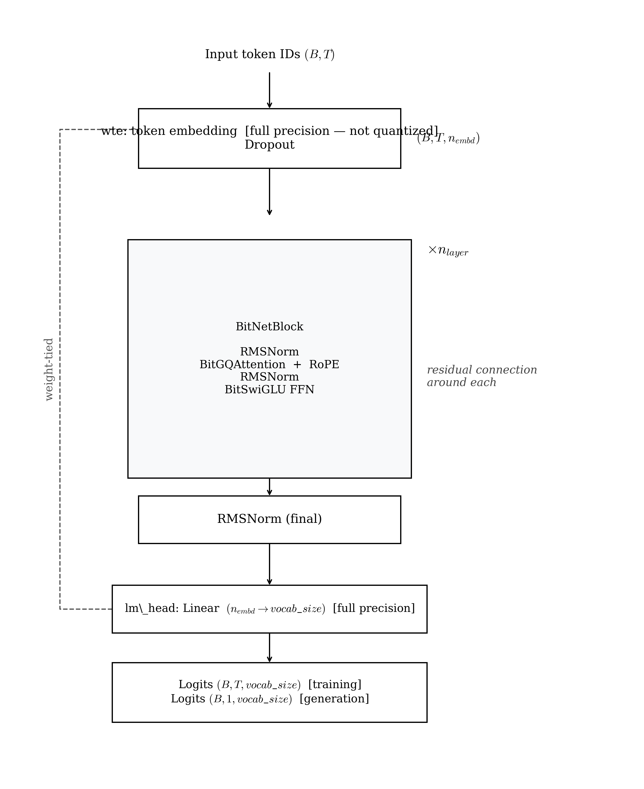

# BitNet — Architecture Reference

BitNetSLM is structurally identical to LLaMA but replaces every linear projection in attention and FFN sublayers with BitLinear — a layer whose weights are quantized to {-1, 0, +1} during the forward pass using the Straight-Through Estimator. Embeddings and the LM head remain full-precision. This document covers the implementation in `src/models/bitnet/`, its configuration, and training dynamics.

---

## Architecture



<!--
```
Input token IDs  (B, T)
        │
   ┌────┴────────────────────────┐
   │  wte: Embedding (fp32/fp16)  │  (B, T, n_embd)   ← FULL PRECISION
   │  dropout                     │
   └────────────┬────────────────┘
                │
        ┌───────┴──────┐  × n_layer
        │  BitNetBlock             │
        │    RMSNorm               │
        │    BitGQAttention        │  Q/K/V/out_proj = BitLinear
        │    RMSNorm               │  residual connection around each
        │    BitSwiGLU FFN         │  W1/W2/W3 = BitLinear
        └───────────────┘
                │
        RMSNorm (final)
                │
        lm_head: Linear(n_embd → vocab_size, fp32/fp16)   ← FULL PRECISION
                │  (weight-tied to wte)
        Logits  (B, T, vocab_size)   [training]
        Logits  (B, 1, vocab_size)   [generation]
```
-->

**Diagram Explanation:**
* **BitLinear:** Replaces standard `Linear` layers in Attention and FFN. In the forward pass, it quantizes inputs to 8-bit integers and weights to ternary values ({-1, 0, +1}). This is optimized for efficient accumulation instead of floating-point multiplication.
* **Full Precision Boundaries:** The token embeddings (`wte`), RMSNorm layers, and the output `lm_head` remain in high precision (fp32/fp16) to preserve modeling fidelity in critical boundaries.

---

## BitLinear Mechanism

`BitLinear` (in `model.py`) is a drop-in replacement for `nn.Linear` that applies two quantization steps during the forward pass, both using the Straight-Through Estimator (STE) so gradients flow as if quantization did not happen:

1. **RMSNorm on input**: The input `x` is normalised before quantization to stabilise the activation range.
2. **Activation quantization (int8)**: Activations are scaled per-token to the int8 range `[-127, 127]` via absolute-max scaling.
3. **Weight quantization (ternary)**: Weights are quantized to `{-1, 0, +1}` via per-tensor absmean scaling.
4. **Linear multiply**: `F.linear(x_q, w_q)` — equivalent to additions and subtractions only.

### Ternary weights via absmean quantization

The weight matrix `W` is quantized as follows:

```
scale = mean(|W|)                         # per-tensor scale
W_q   = clip(round(W / scale), -1, +1)   # ternary: {-1, 0, +1}
```

Multiplying by a ternary weight is equivalent to signed accumulation — the matrix-vector product becomes a series of additions, subtractions, and zeros. On dedicated hardware this replaces expensive floating-point multiplications. In this implementation, `F.linear` is still used with floating-point arithmetic; the ternary nature is preserved numerically but not yet exploited for hardware efficiency.

### Activation quantization via per-token absmax

Activations are quantized to int8 using a per-token scaling factor:

```
scale_x = (2^(bits-1) - 1) / max(|x|, dim=-1)   # per token
x_q     = clip(round(x * scale_x), -128, 127) / scale_x
```

### Straight-Through Estimator (STE)

Both quantization steps use the STE pattern:

```python
x_quantized = x + (quantize(x) - x).detach()
```

This means gradients flow through the quantization operations as if they were identity functions. The full-precision `self.weight` (stored in the optimizer) is updated normally and re-quantized on every forward pass.

### BitLinear mechanism summary

| Step | Operation | Scale | Granularity |
|---|---|---|---|
| Pre-norm | `RMSNorm(x)` | learnable | per-channel |
| Activation quant | absmax → int8 → dequant | `Qp / max(|x|)` | per-token |
| Weight quant | absmean → ternary → dequant | `mean(|W|)` | per-tensor |
| Linear | `F.linear(x_q, w_q)` | — | — |

### Full-precision embeddings and LM head

Following the BitNet b1.58 convention, `wte` and `lm_head` remain in full precision. The embedding lookup is not a matrix multiply — quantization provides no speedup. The LM head output directly determines the probability distribution; quantizing it introduces unnecessary variance in the final logits. Weight tying with `wte` is preserved.

### Memory: ~60 MB float16 vs ~6 MB packed

A float16 model with ~30 M parameters occupies roughly 60 MB. With 1.58-bit packing (each weight stored in ~1.58 bits rather than 16 bits), the same weights occupy approximately 6 MB — a 10× reduction. This implementation trains and evaluates in full precision while preserving the ternary numerical property; packed storage is not applied.

---

## Parameters

### `BitNetConfig` — `src/models/bitnet/config.py`

| Field | Type | Default | Description |
|---|---|---|---|
| `vocab_size` | `int` | `50257` | Vocabulary size. GPT-2 tokenizer has 50 257 tokens. |
| `block_size` | `int` | `128` | Maximum context window in tokens. |
| `n_layer` | `int` | `6` | Number of BitNetBlocks. |
| `n_head` | `int` | `6` | Number of query attention heads. Must divide `n_embd`. |
| `n_kv_head` | `int` | `2` | Number of key/value heads (GQA). Must divide `n_head`. |
| `n_embd` | `int` | `384` | Embedding / hidden dimension. |
| `intermediate_size` | `int` | `1024` | SwiGLU hidden dimension (all three weight matrices are `BitLinear`). |
| `dropout` | `float` | `0.0` | Dropout probability applied to residual connections. |
| `rope_theta` | `float` | `10000.0` | RoPE base frequency. |

There is no `bias` field — BitNet uses no bias terms in any `BitLinear` layer, matching the LLaMA convention.

### Parameter count (approximate)

Identical formula to LLaMA small — quantization does not change parameter count:

```
Embedding:   50257 × 384 ≈ 19.3 M   (full precision, shared with lm_head)
Per block:
  BitGQA:    384×(6+4)×64 + 384²   ≈  390 K
  BitSwiGLU: 3 × 384×1024          ≈ 1.18 M
  RMSNorms:  2 × 384               ≈    1 K
  Subtotal                         ≈ 1.57 M per block

Total:       19.3 M + 6 × 1.57 M   ≈ 29–30 M trainable parameters
Storage:     ~60 MB at float16      /  ~6 MB at 1.58-bit packed
```

---

## Preset Configs

Two ready-to-use model configs are in `configs/bitnet_config/model/`.

### `bitnet_small.yaml` — ~28.8M parameters (~5.5 MB packed)

```yaml
model_type: bitnet
model:
  vocab_size: 50257
  block_size: 128
  n_layer: 6
  n_head: 6
  n_kv_head: 2
  n_embd: 384
  intermediate_size: 1024
  dropout: 0.0
  rope_theta: 10000.0
```

Identical structure to `llama_small` but all attention/FFN linears are `BitLinear`.

### `bitnet_medium.yaml` — ~60 M parameters (~12 MB packed)

```yaml
model_type: bitnet
model:
  vocab_size: 50257
  block_size: 256
  n_layer: 12
  n_head: 8
  n_kv_head: 2
  n_embd: 512
  intermediate_size: 1536
  dropout: 0.1
  rope_theta: 10000.0
```

Larger variant with 12 layers and 512 hidden dim. Packed storage approximately doubles to ~12 MB.

---

## Running BitNet

### Minimal experiment file

```yaml
# configs/bitnet_config/experiments/my_bitnet_run.yaml
_includes_:
  - "../base.yaml"
  - "../data/tinystories.yaml"
  - "../model/bitnet_small.yaml"
  - "../training/default.yaml"
```

```bash
make prep     MODEL=bitnet_config EXP=my_bitnet_run
make train    MODEL=bitnet_config EXP=my_bitnet_run
make generate MODEL=bitnet_config EXP=my_bitnet_run
```

---

## Training Notes

### Gradient flow

The STE allows gradient flow through both weight and activation quantization. The optimizer updates `self.weight` (full precision) and `BitLinear` re-quantizes on every forward pass.

### Training dynamics at small scale

At 30M parameters and 20k steps with the same hyperparameters as the dense baselines, BitNet converged to a best validation loss of **~5.5** vs the dense LLaMA baseline's **~2.55**. The model shows near-flat loss from approximately step 3k onward — the signature of optimizer stall, not slow convergence.

The probable causes, in order of likelihood:

1. **STE gradient signal degradation.** The backward pass treats the quantizer as an identity. The effective gradient per parameter is the gradient of the loss with respect to the quantized weight. At 30M parameters and 20k steps, this is insufficient for the optimizer to move the full-precision weights into a regime where their quantized counterparts form coherent representations. Ma et al. (2024) document this and note that BitNet benefits from longer warmup and lower LR than dense counterparts.

2. **Learning rate mismatch.** The 3e-4 LR was selected for dense float-weight training. Ternary weights are more sensitive to LR: a step that is small in full-precision parameter space can flip many weight signs, causing loss spikes. BitNet papers recommend 3–10× lower LR with longer warmup; this experiment used neither.

3. **Scale threshold.** The BitNet b1.58 paper (Ma et al., 2024) demonstrates viable performance at 100M+ parameters. At 30M parameters, the quantization-induced representation capacity reduction may exceed the threshold below which the model cannot form coherent token predictions within the training budget.

4. **Shared activation quantization pressure.** BitLinear also quantizes activations (int8). Combined with ternary weights, the information bottleneck at 30M scale is severe — each layer sees inputs rounded to 256 levels, limiting the gradient signal flowing to earlier layers.

This is not a failure of the BitNet concept — at larger scales and with architecture-specific tuning, the quantization gap is much smaller (see Ma et al. 2024). At 30M parameters / 20k steps / shared LR, BitNet does not converge competitively. This result defines the minimum scale threshold below which BitNet is not a viable replacement for dense transformers under a shared training budget.

---

## Training Config Reference

Defined in `configs/bitnet_config/training/default.yaml`.

| Field | Default | Description |
|---|---|---|
| `max_iters` | `20000` | Total optimiser steps. |
| `batch_size` | `32` | Sequences per micro-batch. |
| `block_size` | `128` | Context window — must match `model.block_size`. |
| `gradient_accumulation_steps` | `32` | Micro-batches before each weight update. |
| `max_grad_norm` | `1.0` | Gradient clipping threshold. |
| `eval_interval` | `500` | Evaluation frequency in iterations. |
| `eval_batches` | `500` | Validation batches per evaluation. |
| `checkpoint_path` | `outputs/bitnet/checkpoints/` | Checkpoint directory. |
| `optimizer.learning_rate` | `3e-4` | Peak learning rate. |
| `optimizer.betas` | `[0.9, 0.95]` | AdamW momentum coefficients. |
| `optimizer.weight_decay` | `0.1` | L2 regularisation. |
| `scheduler.warmup_steps` | `1000` | Linear LR warmup steps. |
| `scheduler.min_lr` | `3e-5` | Minimum LR after cosine decay. |

---

## Outputs and Results

### Checkpoints

Written to `outputs/bitnet/checkpoints/`. Checkpoints store the **full-precision** `self.weight` tensors from each `BitLinear`. The ternary weights at any point in training can be recovered by calling `_ternary_weight(layer.weight)` on each layer.

---

## File Locations

| Purpose | File |
|---|---|
| Config dataclass | `src/models/bitnet/config.py` |
| Model implementation | `src/models/bitnet/model.py` |
| Plugin registration | `src/models/bitnet/__init__.py` |
| Preset configs | `configs/bitnet_config/model/bitnet_small.yaml`, `bitnet_medium.yaml` |
| RMSNorm primitive | `src/core/normalization.py` |
| RoPE utilities | `src/core/rope.py` |
| Generation loop | `src/core/generation.py` |

---

## References

Ma et al., 2024 — "The Era of 1-bit LLMs: All Large Language Models are in 1.58 Bits." arXiv:2402.17764.

Wang et al., 2023 — "BitNet: Scaling 1-bit Transformers for Large Language Models." arXiv:2310.11453.

Bengio et al., 2013 — "Estimating or Propagating Gradients Through Stochastic Neurons for Conditional Computation." arXiv:1308.3432.
