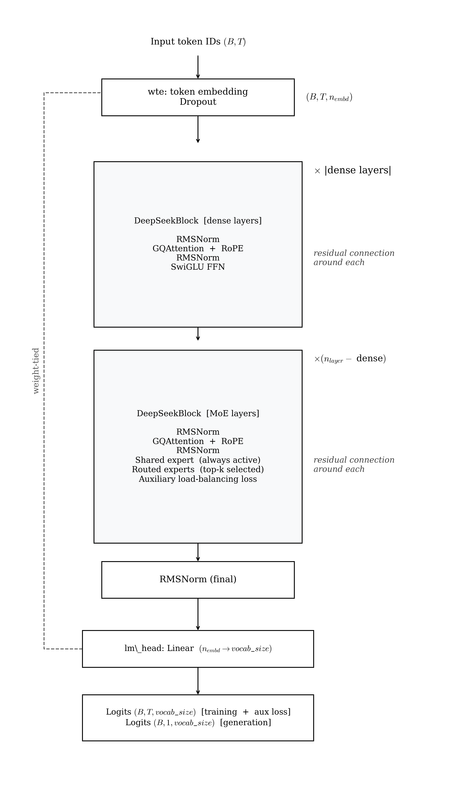

# DeepSeek MoE — Architecture Reference

DeepSeekMoESLM is a LLaMA-style decoder-only transformer in which the FFN of deeper layers is replaced by a Mixture-of-Experts layer combining one always-active shared expert with a pool of fine-grained routed experts. The design separates total parameter capacity from per-token compute cost. This document covers the implementation in `src/models/deepseek_moe/`, its configuration, and how to interpret training results.

---

## Architecture



<!--
```
Input token IDs  (B, T)
        │
   ┌────┴────────────────────────┐
   │  wte: token embedding        │  (B, T, n_embd)
   │  dropout                     │
   └────────────┬────────────────┘
                │
        ┌───────┴──────┐  × n_layer
        │  DeepSeekBlock           │
        │    RMSNorm               │
        │    GQAttention (RoPE)    │  residual connection around each
        │    RMSNorm               │
        │    ┌── if dense layer ───┤
        │    │   SwiGLU FFN        │
        │    └── if MoE layer  ───┤
        │        SharedExpert      │  always active (1 SwiGLU)
        │      + TopKRouter        │  selects top_k of n_routed_experts
        │      + RoutedExperts×K   │  weighted sum of selected experts
        └───────────────┘
                │
        RMSNorm (final)
                │
        lm_head: Linear(n_embd → vocab_size)   ← weight-tied to wte
                │
        Logits  (B, T, vocab_size)   [training — includes aux loss]
        Logits  (B, 1, vocab_size)   [generation]
```
-->

**Diagram Explanation:**
* **Dense vs. MoE layer branching:** The model starts with standard dense SwiGLU layers to build baseline features, then transitions deeper into Mixture of Experts (MoE) layers.
* **SharedExpert:** One specialized feed-forward network that processes every single token, guaranteeing baseline foundational compute.
* **RoutedExperts:** Finer-grained, specialized networks. A token-specific router dynamically activates only the top-K experts per token, vastly expanding model capacity without linearly increasing inference cost.

### Dense vs MoE layer assignment

```
Layer index:   0      1      2      3      4      5
               ▼      ▼      ▼      ▼      ▼      ▼
FFN type:    Dense  Dense   MoE    MoE    MoE    MoE
                    └─ dense_layers=[0,1] (default) ─┘
```

Dense layers use a full-width SwiGLU (`intermediate_size`). MoE layers combine a shared expert plus top-k routed experts, each using the smaller `expert_hidden_dim`.

---

## Key Components

### Shared expert (always active)

Every MoE layer has one expert that processes every token unconditionally, providing a stable gradient path and ensuring baseline computation is always performed regardless of routing decisions:

```
output = shared_expert(x) + sum_k( w_k * expert_k(x) )
```

### Fine-grained expert routing

DeepSeek uses many small experts (e.g. 8 routed experts, `expert_hidden_dim=256`) rather than a few large experts. Each expert covers a finer-grained slice of the representation space. Only `top_k=2` are activated per token, so compute cost grows slowly as `n_routed_experts` increases.

### Top-K router formula

The router is a single linear layer `gate: n_embd → n_routed_experts`. Logits are passed through softmax restricted to the top-k entries, giving normalised routing weights for the selected experts:

```
logits  = gate(x)                              # (B, T, n_experts)
weights = softmax(topk(logits, k=top_k))       # (B, T, top_k)
indices = argtopk(logits, k=top_k)             # (B, T, top_k)
```

### Load-balancing auxiliary loss

Without regularisation, routers collapse to always selecting the same small set of experts. The auxiliary loss encourages uniform expert utilisation across tokens in a batch:

```
aux_loss = n_experts * dot( avg_routing_prob, avg_expert_frequency )
```

A uniform distribution produces `aux_loss = 1.0`. The total training loss is:

```
loss = cross_entropy + router_aux_loss_coef * aux_loss
```

The coefficient `router_aux_loss_coef` (default `0.01`) controls how strongly load balancing is enforced relative to language modelling quality.

---

## Parameters

### `DeepSeekMoEConfig` — `src/models/deepseek_moe/config.py`

| Field | Type | Default | Description |
|---|---|---|---|
| `vocab_size` | `int` | `50257` | Vocabulary size. GPT-2 tokenizer has 50 257 tokens. |
| `block_size` | `int` | `128` | Maximum context window in tokens. |
| `n_layer` | `int` | `6` | Total number of transformer blocks. |
| `n_head` | `int` | `6` | Number of query attention heads. Must divide `n_embd`. |
| `n_kv_head` | `int` | `2` | Number of key/value heads (GQA). Must divide `n_head`. |
| `n_embd` | `int` | `384` | Embedding / hidden dimension. |
| `intermediate_size` | `int` | `1024` | SwiGLU hidden dim for dense-layer FFNs. |
| `n_shared_experts` | `int` | `1` | Shared experts always active in MoE layers. |
| `n_routed_experts` | `int` | `8` | Pool of routed experts per MoE layer. |
| `top_k` | `int` | `2` | Routed experts selected per token. Must be ≤ `n_routed_experts`. |
| `expert_hidden_dim` | `int` | `256` | SwiGLU hidden dim per expert (smaller than dense `intermediate_size`). |
| `dense_layers` | `List[int]` | `[0, 1]` | Layer indices that use a dense FFN. All others use MoE. |
| `router_aux_loss_coef` | `float` | `0.01` | Weight of load-balancing aux loss relative to cross-entropy. |
| `dropout` | `float` | `0.0` | Dropout probability. |
| `rope_theta` | `float` | `10000.0` | RoPE base frequency. |

### Parameter count — total vs active per token

For `deepseek_moe_small` (`n_embd=384, n_layer=6, n_head=6, n_kv_head=2, 2 dense + 4 MoE layers`):

```
Embedding (shared with lm_head):
  50257 × 384 ≈ 19.3 M

Per dense layer (layers 0, 1):
  GQA:     384×(6+4)×64 + 384²     ≈ 390 K
  SwiGLU:  3 × 384×1024             ≈ 1.18 M  (gate + up + down)
  Subtotal per dense layer           ≈ 1.57 M

Per MoE layer (layers 2–5):
  GQA:              same             ≈ 390 K
  Shared expert:   3 × 384×256      ≈ 295 K   (gate + up + down)
  Routed experts:  8 × 3×384×256    ≈ 2.36 M
  Router gate:     384×8             ≈   3 K
  Subtotal per MoE layer             ≈ 3.05 M

Total:
  19.3 M + 2×1.57 M + 4×3.05 M ≈ 34.6 M total

Active per token (dense + shared + top-2 of 8):
  Dense layers:    full FFN active
  MoE layers:     shared + 2 routed experts
  ≈ 28 M active parameters per token forward pass
```

---

## Preset Configs

Two ready-to-use model configs are in `configs/deepseek_moe_config/model/`.

### `deepseek_moe_small.yaml` — ~35 M total, ~28 M active

```yaml
model_type: deepseek_moe
model:
  vocab_size: 50257
  block_size: 128
  n_layer: 6
  n_head: 6
  n_kv_head: 2
  n_embd: 384
  intermediate_size: 1024
  n_shared_experts: 1
  n_routed_experts: 8
  top_k: 2
  expert_hidden_dim: 256
  dense_layers: [0, 1]
  router_aux_loss_coef: 0.01
  dropout: 0.0
  rope_theta: 10000.0
```

Layers 0–1 use dense SwiGLU. Layers 2–5 use MoE (1 shared + 8 routed, activate 2 per token).

### `deepseek_moe_medium.yaml` — ~80 M total, ~35 M active

```yaml
model_type: deepseek_moe
model:
  vocab_size: 50257
  block_size: 256
  n_layer: 8
  n_head: 8
  n_kv_head: 2
  n_embd: 512
  intermediate_size: 1536
  n_shared_experts: 1
  n_routed_experts: 16
  top_k: 2
  expert_hidden_dim: 384
  dense_layers: [0, 1, 2]
  router_aux_loss_coef: 0.01
  dropout: 0.1
  rope_theta: 10000.0
```

Wider model with 16 routed experts and a larger expert hidden dim. Layers 0–2 dense, layers 3–7 MoE.

---

## Running DeepSeek MoE

### Minimal experiment file

```yaml
# configs/deepseek_moe_config/experiments/my_moe_run.yaml
_includes_:
  - "../base.yaml"
  - "../data/tinystories.yaml"
  - "../model/deepseek_moe_small.yaml"
  - "../training/default.yaml"
```

```bash
make prep     MODEL=deepseek_moe_config EXP=my_moe_run
make train    MODEL=deepseek_moe_config EXP=my_moe_run
make generate MODEL=deepseek_moe_config EXP=my_moe_run
```

### Tuning load balancing

If validation loss is acceptable but generated text shows collapsed routing symptoms:

```yaml
model:
  router_aux_loss_coef: 0.05   # increase from 0.01 to force more balanced routing
```

If auxiliary loss dominates and language quality degrades:

```yaml
model:
  router_aux_loss_coef: 0.001
```

---

## Training Config Reference

Defined in `configs/deepseek_moe_config/training/default.yaml`.

| Field | Default | Description |
|---|---|---|
| `max_iters` | `20000` | Total optimiser steps. |
| `batch_size` | `32` | Sequences per micro-batch. |
| `block_size` | `128` | Context window — must match `model.block_size`. |
| `gradient_accumulation_steps` | `32` | Micro-batches before each weight update. |
| `max_grad_norm` | `1.0` | Gradient clipping threshold. |
| `eval_interval` | `500` | Evaluation frequency in iterations. |
| `eval_batches` | `500` | Validation batches averaged per evaluation. |
| `checkpoint_path` | `outputs/deepseek_moe/checkpoints/` | Checkpoint directory. |
| `optimizer.learning_rate` | `3e-4` | Peak learning rate. |
| `optimizer.betas` | `[0.9, 0.95]` | AdamW momentum coefficients. |
| `optimizer.weight_decay` | `0.1` | L2 regularisation. |
| `scheduler.warmup_steps` | `1000` | Linear LR warmup steps. |
| `scheduler.min_lr` | `3e-5` | Minimum LR after cosine decay. |

---

## Outputs and Results

### Checkpoints

Written to `outputs/deepseek_moe/checkpoints/`. Each `.pt` file contains the full model state including expert weights.

### Metrics

`outputs/deepseek_moe/metrics.json` is updated after each evaluation. The reported training loss includes the weighted auxiliary loss. Monitoring both `val_loss` and the routing distribution is recommended.

### Interpreting validation loss

DeepSeekMoESLM achieved a best validation loss of **~3.17** at 20k steps — significantly worse than the dense baselines.

At ~28M active parameters (~35M total) and 20k steps, the MoE advantage does not materialise. The expert pool adds total capacity but the router requires additional data to learn effective token specialisation; the training budget is insufficient for that to happen. The load-balancing auxiliary loss adds a competing training signal that may slow language-model convergence. The MoE advantage over dense models typically appears only at larger scales (Fedus et al. 2022 report it at 100B+ scale). This result is consistent with the literature: the router must converge before the expert pool provides benefit, and 20k steps on TinyStories is not sufficient for that.

---

## File Locations

| Purpose | File |
|---|---|
| Config dataclass | `src/models/deepseek_moe/config.py` |
| Model implementation | `src/models/deepseek_moe/model.py` |
| Plugin registration | `src/models/deepseek_moe/__init__.py` |
| Preset configs | `configs/deepseek_moe_config/model/deepseek_moe_small.yaml`, `deepseek_moe_medium.yaml` |
| RMSNorm primitive | `src/core/normalization.py` |
| RoPE utilities | `src/core/rope.py` |
| SwiGLU primitive | `src/core/ffn.py` |
| Generation loop | `src/core/generation.py` |

---

## References

Dai et al., 2024 — "DeepSeekMoE: Towards Ultimate Expert Specialization in Mixture-of-Experts Language Models." arXiv:2401.06066.

Fedus et al., 2021 — "Switch Transformers: Scaling to Trillion Parameter Models with Simple and Efficient Sparsity." arXiv:2101.03961.

Shazeer et al., 2017 — "Outrageously Large Neural Networks: The Sparsely-Gated Mixture-of-Experts Layer." arXiv:1701.06538.
