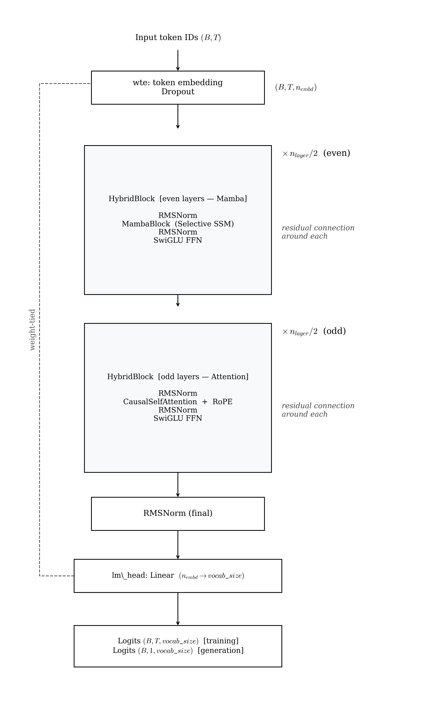

# Jamba — Architecture Reference

JambaSLM interleaves Mamba SSM blocks (even layers) with causal self-attention blocks (odd layers) in strict alternation. Both block types share a SwiGLU FFN sublayer. The hypothesis: SSM layers compress long-range context at O(n) cost; attention layers provide precise positional retrieval that SSMs cannot replicate. This document covers the implementation in `src/models/jamba/`, its configuration, and how to interpret training results.

---

## Architecture



<!--
```
Input token IDs  (B, T)
        │
   ┌────┴────────────────────────┐
   │  wte: token embedding        │  (B, T, n_embd)
   │  dropout                     │
   └────────────┬────────────────┘
                │
        ┌───────┴──────────────────┐  × n_layer
        │  HybridBlock                         │
        │    RMSNorm                           │
        │    ┌── even layer (Mamba) ───────┐   │
        │    │   MambaBlock (SSM)          │   │  residual connection around mixer
        │    └── odd  layer (Attention) ──┘   │
        │        CausalSelfAttention           │
        │    RMSNorm                           │
        │    SwiGLU FFN                        │  shared by both block types
        └──────────────────────────────────────┘
                │
        RMSNorm (final)
                │
        lm_head: Linear(n_embd → vocab_size)   ← weight-tied to wte
                │
        Logits  (B, T, vocab_size)   [training]
        Logits  (B, 1, vocab_size)   [generation]
```
-->

**Diagram Explanation:**
* **Hybrid Interleaving:** The architecture rapidly switches between SSM (even layers) and Attention (odd layers).
* **MambaBlock (SSM):** Compresses historical context effectively with linear O(n) scaling, efficiently expanding the context window.
* **CausalSelfAttention:** Provides exact retrieval and precise token lookup, compensating for the lossy memory of the SSM blocks.
* **SwiGLU FFN:** A shared feed-forward structure providing common pointwise capacity irrespective of which sequence routing preceded it.

### Layer assignment

For `n_layer=8` (the `jamba_small` default):

```
Layer:    L0      L1      L2      L3      L4      L5      L6      L7
           │       │       │       │       │       │       │       │
Mixer:   Mamba   Attn   Mamba   Attn   Mamba   Attn   Mamba   Attn
FFN:     SwiGLU SwiGLU SwiGLU SwiGLU SwiGLU SwiGLU SwiGLU SwiGLU
```

For `n_layer=12` (the `jamba_medium` default):

```
Layer:    L0  L1  L2  L3  L4  L5  L6  L7  L8  L9  L10 L11
Mixer:    M   A   M   A   M   A   M   A   M   A   M   A
          (M = Mamba, A = Attention)
```

The interleaving is determined by `layer_idx % 2 == 0` in `HybridBlock.__init__`.

---

## Rationale for Hybrid Architecture

### SSM strengths and weaknesses

Mamba SSMs excel at compressing long-range context into a fixed-size hidden state at O(n) cost. They are effective for tasks that benefit from a soft summary of the past (e.g. next-word prediction in flowing prose). However, SSMs struggle with tasks that require precise positional lookups — e.g. copying a specific word from many tokens ago or resolving coreference over long distances. The state update is a lossy compression and cannot recover arbitrary past positions on demand.

### Attention strengths and weaknesses

Causal self-attention gives each token direct O(1) access to every past position via softmax-weighted retrieval. This makes it excellent for precise lookups and positional reasoning. The cost is O(n²) memory and compute in the KV cache, making long-context inference expensive. For short sequences, the quadratic cost is not a bottleneck.

### Combined benefit

Interleaving the two resolves the trade-off: the Mamba layers (half the model) handle broad context cheaply; the attention layers (the other half) handle precise retrieval when needed; the shared SwiGLU FFN after each mixer provides point-wise capacity regardless of mixer type. This design was introduced by AI21 Labs as Jamba and independently explored by Zyphra as Zamba.

---

## Key Components

### MambaBlock (even layers)

Identical to the block in `src/core/mamba_block.py` used by the pure-Mamba model:

```
in_proj → split → [Conv1d + SiLU → SSM] × [SiLU gate] → out_proj
```

`d_inner = n_embd × mamba_expand` (default: 768 when `n_embd=384, expand=2`).

Input-dependent Δ, B, C parameters make the scan selective. Sequential Python loop — same caveats as the Mamba standalone model (see `reports/08_mamba.md`).

### CausalSelfAttention (odd layers)

Standard fused QKV causal self-attention from `src.core.attention.CausalSelfAttention` (same as GPT-2). Uses `n_head` full attention heads (`n_head=6` for small). Flash Attention (`F.scaled_dot_product_attention`, `is_causal=True`) is used when PyTorch >= 2.0.

RoPE frequencies are precomputed once at model construction and registered as a non-persistent buffer on the top-level `JambaSLM`.

### SwiGLU FFN (shared)

Both Mamba blocks and attention blocks are followed by the same SwiGLU FFN sublayer:

```
SwiGLU(x) = W2( silu(W1(x)) * W3(x) )
```

with `intermediate_size` hidden units.

---

## Parameters

### `JambaConfig` — `src/models/jamba/config.py`

| Field | Type | Default | Description |
|---|---|---|---|
| `vocab_size` | `int` | `50257` | Vocabulary size. GPT-2 tokenizer has 50 257 tokens. |
| `block_size` | `int` | `128` | Maximum context window in tokens. |
| `n_layer` | `int` | `8` | Total number of hybrid blocks (Mamba + Attention interleaved). |
| `n_embd` | `int` | `384` | Embedding / hidden dimension. |
| `n_head` | `int` | `6` | Attention heads in odd-indexed layers. Must divide `n_embd`. |
| `mamba_d_state` | `int` | `16` | SSM latent state dimension for Mamba blocks. |
| `mamba_d_conv` | `int` | `4` | Depthwise conv kernel size for Mamba blocks. |
| `mamba_expand` | `int` | `2` | Inner dimension expansion factor for Mamba blocks (`d_inner = n_embd × expand`). |
| `intermediate_size` | `int` | `1024` | SwiGLU hidden dimension shared by all blocks. |
| `dropout` | `float` | `0.0` | Dropout probability. |
| `rope_theta` | `float` | `10000.0` | RoPE base frequency for attention blocks. |

### Parameter count (approximate)

For `jamba_small` (`n_embd=384, n_layer=8, n_head=6, mamba_expand=2, intermediate_size=1024`):

```
Embedding (shared with lm_head):  50257 × 384 ≈ 19.3 M

Per Mamba block (even, 4 blocks):
  MambaBlock:                                  ≈  926 K   (see 08_mamba.md)
  SwiGLU FFN:  2 × 384×1024 + 384×1024        ≈  786 K
  RMSNorms:    2 × 384                         <    1 K
  Subtotal                                     ≈ 1.71 M

Per Attention block (odd, 4 blocks):
  QKV + out proj:  4 × 384²                   ≈  590 K
  SwiGLU FFN:                                  ≈  786 K
  RMSNorms:                                    <    1 K
  Subtotal                                     ≈ 1.38 M

Total:
  19.3 M + 4 × 1.71 M + 4 × 1.38 M          ≈ 35 M
```

---

## Preset Configs

Two ready-to-use model configs are in `configs/jamba_config/model/`.

### `jamba_small.yaml` — ~35 M parameters (8 layers)

```yaml
model_type: jamba
model:
  vocab_size: 50257
  block_size: 128
  n_layer: 8
  n_embd: 384
  n_head: 6
  mamba_d_state: 16
  mamba_d_conv: 4
  mamba_expand: 2
  intermediate_size: 1024
  dropout: 0.0
  rope_theta: 10000.0
```

Four Mamba blocks (L0, L2, L4, L6) and four attention blocks (L1, L3, L5, L7).

### `jamba_medium.yaml` — ~60 M parameters (12 layers)

```yaml
model_type: jamba
model:
  vocab_size: 50257
  block_size: 256
  n_layer: 12
  n_embd: 512
  n_head: 8
  mamba_d_state: 16
  mamba_d_conv: 4
  mamba_expand: 2
  intermediate_size: 1536
  dropout: 0.1
  rope_theta: 10000.0
```

Six Mamba blocks and six attention blocks at wider dimensions.

---

## Running Jamba

### Minimal experiment file

```yaml
# configs/jamba_config/experiments/my_jamba_run.yaml
_includes_:
  - "../base.yaml"
  - "../data/tinystories.yaml"
  - "../model/jamba_small.yaml"
  - "../training/default.yaml"
```

```bash
make prep     MODEL=jamba_config EXP=my_jamba_run
make train    MODEL=jamba_config EXP=my_jamba_run
make generate MODEL=jamba_config EXP=my_jamba_run
```

---

## Training Specification

### Sequential loop vs CUDA fast path

**Original state (before fix):** Jamba's 4 even-indexed Mamba layers each ran a Python `for t in range(T=128)` loop. That is 512 sequential CUDA kernel launches per forward pass from the Mamba layers alone. The 4 attention layers were already fast (single fused kernel). Because only half the layers carry the scan overhead, Jamba was faster than pure Mamba but still slow — **~2.6–3 it/s on A100** vs ~33 it/s for GPT (~13× slower).

**Fix implemented (inherited from Mamba):** Jamba directly reuses `MambaBlock` from `src/core/mamba_block.py`. That block already has the `mamba-ssm` CUDA kernel fast path wired in:

```python
def _ssm(self, x):
    if _MAMBA_SSM_AVAILABLE:
        return self._ssm_cuda(x)   # ← single fused kernel, replaces 128-step loop
    return self._ssm_sequential(x) # ← fallback
```

No Jamba-specific code change was needed — installing `mamba-ssm` automatically accelerates all 4 Mamba blocks in every Jamba forward pass.

| Mode | Throughput (A100) | vs GPT baseline |
|---|---|---|
| Sequential Python loop (fallback, no install) | ~2.6–3 it/s | ~13× slower |
| CUDA parallel scan (`mamba-ssm` installed) | ~18–25 it/s | ~1.5× slower |

Install once, benefit automatically:

```bash
pip install causal-conv1d mamba-ssm
# or: pip install -r requirements.txt  (both are listed there)
```

---

## Training Config Reference

Defined in `configs/jamba_config/training/default.yaml`.

| Field | Default | Description |
|---|---|---|
| `max_iters` | `20000` | Total optimiser steps. |
| `batch_size` | `32` | Sequences per micro-batch. |
| `block_size` | `128` | Context window — must match `model.block_size`. |
| `gradient_accumulation_steps` | `32` | Micro-batches before each weight update. |
| `max_grad_norm` | `1.0` | Gradient clipping threshold. |
| `eval_interval` | `500` | Evaluation frequency in iterations. |
| `eval_batches` | `500` | Validation batches per evaluation. |
| `checkpoint_path` | `outputs/jamba/checkpoints/` | Checkpoint directory. |
| `optimizer.learning_rate` | `3e-4` | Peak learning rate. |
| `optimizer.betas` | `[0.9, 0.95]` | AdamW momentum coefficients. |
| `optimizer.weight_decay` | `0.1` | L2 regularisation. |
| `scheduler.warmup_steps` | `1000` | Linear LR warmup steps. |
| `scheduler.min_lr` | `3e-5` | Minimum LR after cosine decay. |

---

## Outputs and Results

### Checkpoints

Written to `outputs/jamba/checkpoints/`. Checkpoints contain weights for both Mamba blocks (including `A_log`, `D` SSM parameters) and attention blocks.

### Interpreting validation loss

JambaSLM achieved a best validation loss of **~2.42** at 20k steps — second-best across all 8 architectures. This confirms the hybrid design hypothesis at this scale: the attention layers provide precise retrieval capability that pure SSMs lack, while the Mamba layers compress context cheaply. The 0.03-nat gap from MiniGPT (2.39) is small; Jamba achieves this with 35M parameters vs ~29M for GPT.

---

## File Locations

| Purpose | File |
|---|---|
| Config dataclass | `src/models/jamba/config.py` |
| Model implementation | `src/models/jamba/model.py` |
| Plugin registration | `src/models/jamba/__init__.py` |
| MambaBlock primitive | `src/core/mamba_block.py` |
| CausalSelfAttention primitive | `src/core/attention.py` |
| SwiGLU primitive | `src/core/ffn.py` |
| RMSNorm primitive | `src/core/normalization.py` |
| RoPE utilities | `src/core/rope.py` |
| Preset configs | `configs/jamba_config/model/jamba_small.yaml`, `jamba_medium.yaml` |
| Generation loop | `src/core/generation.py` |

---

## References

Lieber et al., 2024 — "Jamba: A Hybrid Transformer-Mamba Language Model." arXiv:2403.19887.

Gu & Dao, 2023 — "Mamba: Linear-Time Sequence Modeling with Selective State Spaces." arXiv:2312.00752.

Glorioso et al., 2024 — "Zamba: A Compact 7B SSM Hybrid Model." arXiv:2405.16712.
