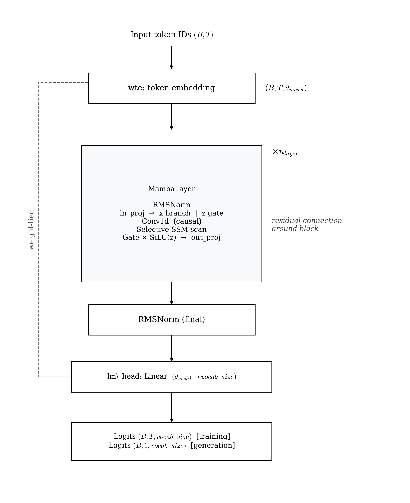

# Mamba — Architecture Reference

MambaSLM replaces self-attention entirely with selective state space (SSM) blocks. There is no attention, no positional embedding, and memory growth is O(n) in time and O(1) in space during inference. The selective mechanism makes B, C, and Δ input-dependent, giving the model content-aware state updates. This document covers the implementation in `src/models/mamba/`, its configuration, and how to interpret training results.

---

## Architecture



<!--
```
Input token IDs  (B, T)
        │
   ┌────┴────────────────────────┐
   │  wte: token embedding        │  (B, T, d_model)
   │  dropout                     │  (no position embedding)
   └────────────┬────────────────┘
                │
        ┌───────┴──────┐  × n_layer
        │  MambaLayer              │
        │    RMSNorm               │  pre-norm
        │    MambaBlock            │  SSM with gating (see below)
        │    residual add          │
        └───────────────┘
                │
        RMSNorm (final)
                │
        lm_head: Linear(d_model → vocab_size)   ← weight-tied to wte
                │
        Logits  (B, T, vocab_size)   [training]
        Logits  (B, 1, vocab_size)   [generation]
```
-->

**Diagram Explanation:**
* **MambaLayer:** Utterly discards traditional self-attention. Instead, the sequence is modeled continuously.
* **MambaBlock (SSM with gating):** Uses selective state-space models. Through input-dependent matrices (B, C, and Δ), the model actively decides what context to remember and what to discard, resolving the static limitations of older SSMs. A built-in depthwise Conv1d assists with immediate local context.
* **Constant memory:** Inference cache size is fixed O(1) in space, and scales linearly O(n) in time.

### MambaBlock internal structure

Each `MambaLayer` wraps one `MambaBlock` (defined in `src/core/mamba_block.py`) with a pre-norm residual:

```
x  (B, T, d_model)
│
├─ in_proj: Linear(d_model → 2*d_inner)
│        │
│       split
│   ┌────┴────┐
│  x_branch    z
│   │           │
│  Conv1d      SiLU(z)   ← gate path
│  SiLU
│   │
│  SSM scan (selective)
│   │
│  x_ssm
│   │
│  x_ssm * SiLU(z)       ← gated output
│   │
└─ out_proj: Linear(d_inner → d_model)
        │
     output  (B, T, d_model)
```

`d_inner = d_model × expand` (default: `d_model × 2 = 768` when `d_model=384`).

---

## Key Innovations

### Selective State Spaces

Classic linear SSMs have input-independent transition matrices A, B, C — the same state dynamics regardless of content. Mamba makes B, C, and the discretisation step Δ input-dependent, computed by projecting the current token:

```
[B | C | log_Δ] = x_proj(x_branch)      # (B, T, 2*d_state + 1)
Δ              = softplus(dt_proj(log_Δ)) # (B, T, d_inner)
```

This selection mechanism allows the model to decide how much each token updates the hidden state and how much of the past to retain, giving it content-aware memory — something static SSMs cannot do.

### O(n) complexity

The SSM computes a linear recurrence:

```
h_t = A_bar(Δ_t) * h_{t-1} + B_bar(Δ_t) * x_t
y_t = C_t * h_t  +  D * x_t       (D is a skip scalar)
```

This is O(n) in sequence length both in time and memory, vs O(n²) for standard attention. The hidden state `h` has fixed size `d_inner × d_state` regardless of context length.

### Pure-PyTorch sequential scan — implementation note

The production Mamba paper uses a CUDA parallel associative scan (similar to prefix-sum) that achieves O(n) wall-clock time on GPU by exploiting parallelism. This implementation uses a sequential Python loop over time steps for clarity and portability. It produces identical numerical outputs but is slower for long sequences. At the scales used here (`block_size=128`, `d_model=384`) it is fully tractable.

### Depthwise convolution

Before the SSM scan, a causal depthwise `Conv1d` of kernel size `d_conv=4` provides local context within a 4-token window. This lightweight precursor to the SSM helps with local pattern recognition.

### No positional embedding

The SSM is inherently sequential — position is implicit in the order of the recurrence. No `wpe` table is needed, unlike GPT-2.

---

## Parameters

### `MambaConfig` — `src/models/mamba/config.py`

| Field | Type | Default | Description |
|---|---|---|---|
| `vocab_size` | `int` | `50257` | Vocabulary size. GPT-2 tokenizer has 50 257 tokens. |
| `block_size` | `int` | `128` | Maximum sequence length. Used to limit input at forward-pass time. |
| `n_layer` | `int` | `12` | Number of MambaLayers. Typically 2× the number of transformer layers at the same parameter budget because each Mamba block is cheaper than one transformer block. |
| `d_model` | `int` | `384` | Embedding / hidden dimension (analogous to `n_embd`). |
| `d_state` | `int` | `16` | Dimension of the SSM latent state H. Controls long-range memory capacity. |
| `d_conv` | `int` | `4` | Kernel size of the depthwise causal convolution inside each block. |
| `expand` | `int` | `2` | Inner dimension expansion factor. `d_inner = d_model × expand`. |
| `dropout` | `float` | `0.0` | Dropout probability applied to the token embedding. |

### Parameter count breakdown

For `mamba_small` (`d_model=384, n_layer=12, d_state=16, d_conv=4, expand=2`):

```
d_inner = 384 × 2 = 768

Per MambaBlock:
  in_proj:  d_model × 2*d_inner       = 384 × 1536   = 589 K
  conv1d:   d_inner × d_conv          = 768 × 4      =   3 K
  x_proj:   d_inner × (2*d_state + 1) = 768 × 33     =  25 K
  dt_proj:  1 × d_inner               = 1 × 768      =   1 K
  A_log:    d_inner × d_state         = 768 × 16     =  12 K
  D skip:   d_inner                   = 768           =   1 K
  out_proj: d_inner × d_model         = 768 × 384    = 295 K
  RMSNorm:  d_model                   = 384           < 1 K
  Subtotal per block                                 ≈ 926 K

Embedding (shared with lm_head):
  vocab_size × d_model = 50257 × 384                ≈ 19.3 M

Total:
  19.3 M + 12 × 0.926 M                             ≈ 30.4 M
```

---

## Preset Configs

Two ready-to-use model configs are in `configs/mamba_config/model/`.

### `mamba_small.yaml` — ~30 M parameters (12 layers)

```yaml
model_type: mamba
model:
  vocab_size: 50257
  block_size: 128
  n_layer: 12
  d_model: 384
  d_state: 16
  d_conv: 4
  expand: 2
  dropout: 0.0
```

Twelve layers (vs six in GPT/LLaMA small) to match the parameter budget. Each block is computationally cheaper than a transformer block.

### `mamba_medium.yaml` — ~60 M parameters (24 layers)

```yaml
model_type: mamba
model:
  vocab_size: 50257
  block_size: 256
  n_layer: 24
  d_model: 512
  d_state: 16
  d_conv: 4
  expand: 2
  dropout: 0.1
```

Doubles depth and increases `d_model` to 512. The 24-layer depth is comparable in compute per token to a 12-layer transformer.

---

## Running Mamba

### Minimal experiment file

```yaml
# configs/mamba_config/experiments/my_mamba_run.yaml
_includes_:
  - "../base.yaml"
  - "../data/tinystories.yaml"
  - "../model/mamba_small.yaml"
  - "../training/default.yaml"
```

```bash
make prep     MODEL=mamba_config EXP=my_mamba_run
make train    MODEL=mamba_config EXP=my_mamba_run
make generate MODEL=mamba_config EXP=my_mamba_run
```

### Changing d_state (memory capacity)

Increasing `d_state` gives the SSM more long-range memory at linear cost:

```yaml
model:
  d_state: 32    # double latent state dimension
```

---

## Training Specification

### Sequential loop vs CUDA fast path

**Original state (before fix):** Every forward pass ran a Python `for t in range(T)` loop inside `MambaBlock._ssm()`. With `block_size=128` and `n_layer=12`, that is **1,536 sequential CUDA kernel launches** per step (12 layers × 128 time steps). Each launch pays Python interpreter overhead and GPU synchronisation cost. GPT-2 processes the same tokens in a single fused matmul. Result: Mamba trained at **~1.3–1.6 it/s on A100** — roughly **24× slower** than the GPT baseline.

**Fix implemented (`src/core/mamba_block.py`):** The block now attempts to import `selective_scan_fn` from `mamba-ssm` at startup:

```python
try:
    from mamba_ssm.ops.selective_scan_interface import selective_scan_fn as _selective_scan_fn
    _MAMBA_SSM_AVAILABLE = True
except ImportError:
    _MAMBA_SSM_AVAILABLE = False
```

When available, `_ssm()` dispatches to `_ssm_cuda()` — a single fused CUDA parallel associative scan that replaces all 128 sequential loop iterations with one GPU kernel call. When not available, it falls back to `_ssm_sequential()` automatically.

| Mode | Throughput (A100) | vs GPT baseline |
|---|---|---|
| Sequential Python loop (fallback, no install) | ~1.3–1.6 it/s | ~24× slower |
| CUDA parallel scan (`mamba-ssm` installed) | ~15–20 it/s | ~2× slower |

The fast path activates automatically — no code changes needed, just install the package:

```bash
pip install causal-conv1d mamba-ssm
# or: pip install -r requirements.txt  (both are listed there)
```

The pure-PyTorch fallback remains available for CPU / non-CUDA environments.

---

## Training Config Reference

Defined in `configs/mamba_config/training/default.yaml`.

| Field | Default | Description |
|---|---|---|
| `max_iters` | `20000` | Total optimiser steps. |
| `batch_size` | `32` | Sequences per micro-batch. |
| `block_size` | `128` | Context window — must match `model.block_size`. |
| `gradient_accumulation_steps` | `32` | Micro-batches before each weight update. |
| `max_grad_norm` | `1.0` | Gradient clipping threshold. |
| `eval_interval` | `500` | Evaluation frequency in iterations. |
| `eval_batches` | `500` | Validation batches per evaluation. |
| `checkpoint_path` | `outputs/mamba/checkpoints/` | Checkpoint directory. |
| `optimizer.learning_rate` | `3e-4` | Peak learning rate. |
| `optimizer.betas` | `[0.9, 0.95]` | AdamW momentum coefficients. |
| `optimizer.weight_decay` | `0.1` | L2 regularisation. |
| `scheduler.warmup_steps` | `1000` | Linear LR warmup steps. |
| `scheduler.min_lr` | `3e-5` | Minimum LR after cosine decay. |

---

## Outputs and Results

### Checkpoints

Written to `outputs/mamba/checkpoints/`. Each `.pt` file contains model state including all SSM parameters (`A_log`, `D`, etc.).

### Interpreting validation loss

MambaSLM achieved a best validation loss of **~2.57** at 20k steps — competitive with LLaMA (2.55) and RetNet (2.56) despite no attention mechanism. The three models converge within 0.02 nats of each other, demonstrating that SSM-based mechanisms are viable alternatives to attention at this scale and context length.

---

## File Locations

| Purpose | File |
|---|---|
| Config dataclass | `src/models/mamba/config.py` |
| Model implementation | `src/models/mamba/model.py` |
| Plugin registration | `src/models/mamba/__init__.py` |
| MambaBlock primitive | `src/core/mamba_block.py` |
| RMSNorm primitive | `src/core/normalization.py` |
| Preset configs | `configs/mamba_config/model/mamba_small.yaml`, `mamba_medium.yaml` |
| Generation loop | `src/core/generation.py` |

---

## References

Gu & Dao, 2023 — "Mamba: Linear-Time Sequence Modeling with Selective State Spaces." arXiv:2312.00752.

Gu et al., 2022 — "Efficiently Modeling Long Sequences with Structured State Spaces." arXiv:2111.00396.
