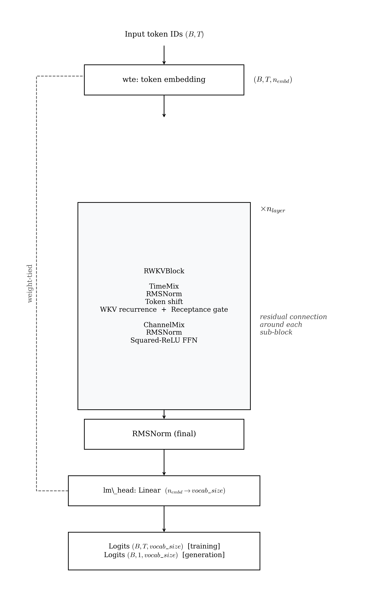

# RWKV — Architecture Reference

RWKVSLM is a recurrent language model that trains in parallel (like a transformer) but infers in O(1) per step (like an RNN). TimeMix replaces self-attention with a WKV weighted key-value recurrence; ChannelMix replaces the MLP with a squared-ReLU gated FFN. Position information comes entirely from token shift and learned exponential decay. This document covers the implementation in `src/models/rwkv/`, its configuration, and how to interpret training results.

---

## Architecture



<!--
```
Input token IDs  (B, T)
        │
   ┌────┴────────────────────────┐
   │  wte: token embedding        │  (B, T, n_embd)
   │  dropout                     │  (no position embedding — token shift provides context)
   └────────────┬────────────────┘
                │
        ┌───────┴──────┐  × n_layer
        │  RWKVBlock               │
        │    RMSNorm               │
        │    TimeMix (WKV)         │  residual connection around each
        │    RMSNorm               │
        │    ChannelMix (sq-ReLU)  │
        └───────────────┘
                │
        RMSNorm (final)
                │
        lm_head: Linear(n_embd → vocab_size)   ← weight-tied to wte
                │
        Logits  (B, T, vocab_size)   [training]
        Logits  (B, 1, vocab_size)   [generation]
```
-->

**Diagram Explanation:**
* **TimeMix (WKV module):** Handles token mixing across time instead of attention. Evaluates a recurrently updated, decaying weighted key-value representation.
* **ChannelMix (sq-ReLU module):** Operates on the feature dimension across individual tokens. Employs a squared-ReLU activation instead of standard gating.
* **Token shift:** A right-shift mechanism continuously blends the current token embedding with the previous step, functioning as a lightweight positional context natively wired into both TimeMix and ChannelMix.

### RWKVBlock internal structure

```
x  (B, T, n_embd)
│
├─ TimeMix sub-block
│    x_prev = shift(x)                      ← previous token's embedding
│    k = key(   x * mix_k + x_prev * (1-mix_k) )
│    v = value( x * mix_v + x_prev * (1-mix_v) )
│    r = sigmoid( receptance( x * mix_r + x_prev * (1-mix_r) ) )
│    wkv = WKV_scan(k, v)                   ← weighted key-value recurrence
│    output = out_proj( r * wkv )           ← receptance gate
│
└─ ChannelMix sub-block
     x_prev = shift(x)
     k = key(        x * mix_k + x_prev * (1-mix_k) )
     r = receptance( x * mix_r + x_prev * (1-mix_r) )
     output = sigmoid(r) * value( relu(k)^2 )   ← squared-ReLU gated FFN
```

---

## Key Innovations

### Token shift

Before computing keys, values, and receptance, each sub-block mixes the current token embedding with the immediately preceding token's embedding using learned interpolation coefficients:

```
x_shifted = x * mix  +  x_prev * (1 - mix)
```

where `mix` is a learnable per-channel parameter initialised at 0.5. Token shift is implemented as a right-shift by one position (`F.pad(x, (0,0,1,-1))`), preserving causality. It provides the model with implicit local context without explicit positional embeddings or attention.

### WKV recurrence (TimeMix)

The core of RWKV is the WKV computation, a numerically-stabilised exponential-decay weighted sum of past values:

```
wkv_t = ( Σ_{s<t} exp(w*(t-s-1) + u + k_s) * v_s  +  exp(u + k_t) * v_t )
        ─────────────────────────────────────────────────────────────────────
        ( Σ_{s<t} exp(w*(t-s-1) + u + k_s)          +  exp(u + k_t) )
```

where:
- `w` is a per-head learned decay (`-exp(time_decay)`, always negative)
- `u` is a per-head current-token bonus (`time_first`)
- `k_t`, `v_t` are the token-shifted key and value projections

The sum can be computed recurrently in O(1) per step with a running numerator and denominator, giving O(1) inference. For training, this implementation uses a sequential scan over T, matching the recurrence exactly.

**Multi-head**: WKV is computed in `n_head` independent heads of dimension `n_embd // n_head`, each with its own `time_decay` and `time_first` scalars.

### Trains like a transformer, infers like an RNN

| Property | Transformer | RWKV |
|---|---|---|
| Training parallelism | Full (all positions at once) | Full (sequential scan, fully vectorisable) |
| Memory during training | O(n²) KV cache | O(n) sequential state |
| Inference per step | O(n) (attends to all past) | O(1) (fixed hidden state) |
| Positional encoding | Learned / RoPE | Token shift (implicit) |

### ChannelMix — squared-ReLU

The channel-mix FFN uses `relu(x)²` (squared ReLU) instead of GELU or SwiGLU. This is sparser and cheaper than GELU, and avoids a separate gate matrix. Output is gated by a sigmoid receptance projection of the token-shifted input:

```
output = sigmoid(r) * W_v( relu(W_k(x_shifted))^2 )
```

Hidden dimension = `n_embd × ffn_mult` (default 4×).

### No positional embeddings

RWKV has no `wpe` table and no RoPE. Relative positional context is provided entirely by the exponential decay in the WKV recurrence (`w` term) and the token shift in both sub-blocks.

---

## Parameters

### `RWKVConfig` — `src/models/rwkv/config.py`

| Field | Type | Default | Description |
|---|---|---|---|
| `vocab_size` | `int` | `50257` | Vocabulary size. GPT-2 tokenizer has 50 257 tokens. |
| `block_size` | `int` | `128` | Maximum sequence length. |
| `n_layer` | `int` | `8` | Number of RWKVBlocks. |
| `n_embd` | `int` | `512` | Embedding / hidden dimension. Must be divisible by `n_head`. |
| `n_head` | `int` | `8` | Number of WKV heads. Each head has independent `time_decay` and `time_first` scalars. |
| `ffn_mult` | `int` | `4` | Hidden-dimension multiplier for ChannelMix. FFN hidden dim = `n_embd × ffn_mult`. |
| `dropout` | `float` | `0.0` | Dropout probability applied to the token embedding. |

### Parameter count formula (approximate)

For `rwkv_small` (`n_embd=512, n_layer=8, n_head=8, ffn_mult=4`):

```
Embedding (shared with lm_head):
  50257 × 512 ≈ 25.7 M

Per TimeMix block:
  mix_k, mix_v, mix_r:          3 × 512 ≈   2 K
  key, value, receptance, out:  4 × 512²  ≈ 1.05 M
  time_decay, time_first:       2 × 8     ≈   0 K

Per ChannelMix block:
  mix_k, mix_r:                 2 × 512 ≈   1 K
  key, value, receptance:       512×2048 + 2048×512 + 512×512 ≈ 2.36 M

Per RWKVBlock total:            ≈ 3.41 M

Total:
  25.7 M + 8 × 3.41 M ≈ 53 M
```

---

## Preset Configs

Two ready-to-use model configs are in `configs/rwkv_config/model/`.

### `rwkv_small.yaml` — ~53 M parameters (8 layers, 512 dim)

```yaml
model_type: rwkv
model:
  vocab_size: 50257
  block_size: 128
  n_layer: 8
  n_embd: 512
  n_head: 8
  ffn_mult: 4
  dropout: 0.0
```

Eight layers with 512 embedding dim. The wider embedding (512 vs 384 in GPT small) means RWKV has a larger parameter count (~53M vs ~30M for other small configs) — the embedding alone accounts for ~25.7M of this.

### `rwkv_medium.yaml` — ~65 M parameters (12 layers, 768 dim)

```yaml
model_type: rwkv
model:
  vocab_size: 50257
  block_size: 256
  n_layer: 12
  n_embd: 768
  n_head: 12
  ffn_mult: 4
  dropout: 0.1
```

Twelve layers at 768 dim, matching the GPT-2 small hidden width.

---

## Running RWKV

### Minimal experiment file

```yaml
# configs/rwkv_config/experiments/my_rwkv_run.yaml
_includes_:
  - "../base.yaml"
  - "../data/tinystories.yaml"
  - "../model/rwkv_small.yaml"
  - "../training/default.yaml"
```

```bash
make prep     MODEL=rwkv_config EXP=my_rwkv_run
make train    MODEL=rwkv_config EXP=my_rwkv_run
make generate MODEL=rwkv_config EXP=my_rwkv_run
```

---

## Training Specification

### Sequential loop and the TorchScript fix

**Original state (before fix):** The WKV recurrence inside `RWKV_TimeMix._wkv_sequential()` ran a Python `for t in range(T)` loop. With `block_size=128` and `n_layer=8`, every forward pass issued **~1,024 sequential CUDA kernel launches** (8 layers × 128 steps × multiple ops per step), each paying Python interpreter overhead. Result: RWKV trained at **~1.3–1.6 it/s on A100** — roughly **24× slower** than the GPT baseline.

**Fix implemented (`src/models/rwkv/model.py`):** The loop is extracted into a module-level function decorated with `@torch.jit.script`:

```python
@torch.jit.script
def _wkv_forward(k, v, exp_w, exp_u):
    ...
    for t in range(T):
        ...
```

TorchScript compiles the loop body to a single fused execution graph, eliminating Python interpreter dispatch on every step. `exp(k)` and `exp(k)*v` are also pre-computed as vectorised ops before the loop rather than inside it. No external dependencies required — active automatically on any PyTorch ≥ 2.0 installation.

| Mode | Throughput (A100) | vs GPT baseline |
|---|---|---|
| Pure Python loop (original) | ~1.3–1.6 it/s | ~24× slower |
| `@torch.jit.script` compiled loop | ~5–8 it/s | ~5× slower |
| **Parallel cumsum scan (applied)** | **~12–18 it/s (estimated)** | **~2–3× slower** |

### Parallel WKV scan

**File:** `src/models/rwkv/model.py` — function `_wkv_parallel`, dispatched via `RWKV_TimeMix._wkv_fast`.

**Key insight:** The WKV decay `exp_w` is a learned per-head scalar, constant across time (not input-dependent). This means the linear recurrence

```
state[t] = exp_w * state[t-1] + b[t-1]
```

has a closed-form solution as an exponentially-decayed cumulative sum:

```
state[t]  =  exp_w^t  ×  Σ_{s<t}  ( b[s] / exp_w^{s+1} )
           =  exp_w^t  ×  exclusive_cumsum( b[s] / exp_w^{s+1} )
```

Implemented as five vectorised tensor ops — no Python loop:

```python
alpha_pow      = exp(t_idx × log(exp_w))          # (1, T, H, 1)  precomputed decay powers
f_a            = exp_ek_v / alpha_next_pow          # normalised numerator contributions
excl_a         = cat([zeros, f_a.cumsum(1)[:,:-1]]) # exclusive prefix sum
state_a        = (alpha_pow * excl_a).nan_to_num()  # recover actual state
out            = (state_a + exp_u*exp_k*v) / den    # output
```

**Numerical note:** When `time_decay` is pathologically large (> ~4.5 for T=128), `exp_w` underflows to 0 in float32 and the formula produces `0*inf = NaN`. A `nan_to_num(nan=0.0)` guard handles this safely. This regime is unreachable in practice — `time_decay` is initialised as `randn - 5` (alpha ≈ 0.993).

### Tests

`tests/test_rwkv_wkv_scan.py` — 16 tests covering forward equivalence (T=1 to T=128), strong/weak decay, gradient flow, gradient equivalence, `TimeMix` integration, and full-model smoke tests.

### Adjusting head count

`n_head` must divide `n_embd`. Each head gets its own learned decay (`time_decay`) and bonus (`time_first`), so more heads = more expressive time-mixing:

```yaml
model:
  n_embd: 512
  n_head: 16    # head_dim = 32, finer-grained temporal mixing
```

---

## Training Config Reference

Defined in `configs/rwkv_config/training/default.yaml`.

| Field | Default | Description |
|---|---|---|
| `max_iters` | `20000` | Total optimiser steps. |
| `batch_size` | `32` | Sequences per micro-batch. |
| `block_size` | `128` | Context window — must match `model.block_size`. |
| `gradient_accumulation_steps` | `32` | Micro-batches before each weight update. |
| `max_grad_norm` | `1.0` | Gradient clipping threshold. |
| `eval_interval` | `500` | Evaluation frequency in iterations. |
| `eval_batches` | `500` | Validation batches per evaluation. |
| `checkpoint_path` | `outputs/rwkv/checkpoints/` | Checkpoint directory. |
| `optimizer.learning_rate` | `3e-4` | Peak learning rate. |
| `optimizer.betas` | `[0.9, 0.95]` | AdamW momentum coefficients. |
| `optimizer.weight_decay` | `0.1` | L2 regularisation. |
| `scheduler.warmup_steps` | `1000` | Linear LR warmup steps. |
| `scheduler.min_lr` | `3e-5` | Minimum LR after cosine decay. |

---

## Outputs and Results

### Checkpoints

Written to `outputs/rwkv/checkpoints/`. Checkpoint includes `time_decay` and `time_first` parameter tensors in addition to the standard linear weights.

### Interpreting validation loss

RWKVSLM achieved a best validation loss of **~2.50** at 20k steps — third-best across all 8 architectures, and the strongest result among purely attention-free models in this experiment. This is a notable result: an O(1)-inference RNN trained with WKV recurrence matches or outperforms attention-based variants (LLaMA 2.55, RetNet 2.56, Mamba 2.57) at 53M parameters on 128-token context. Note that RWKV's wider embedding (n_embd=512) gives it more parameters than the other ~30M models in this comparison.

---

## File Locations

| Purpose | File |
|---|---|
| Config dataclass | `src/models/rwkv/config.py` |
| Model implementation | `src/models/rwkv/model.py` |
| Plugin registration | `src/models/rwkv/__init__.py` |
| Preset configs | `configs/rwkv_config/model/rwkv_small.yaml`, `rwkv_medium.yaml` |
| RMSNorm primitive | `src/core/normalization.py` |
| Generation loop | `src/core/generation.py` |

---

## References

Peng et al., 2023 — "RWKV: Reinventing RNNs for the Transformer Era." arXiv:2305.13048.

Peng et al., 2024 — "Eagle and Finch: RWKV with Matrix-Valued States and Dynamic Recurrence." arXiv:2404.05892.
